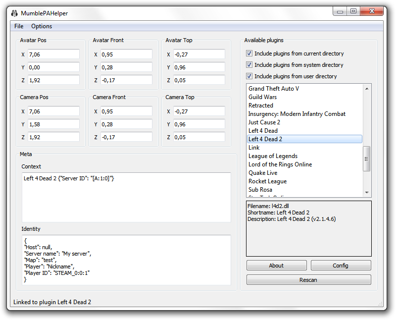
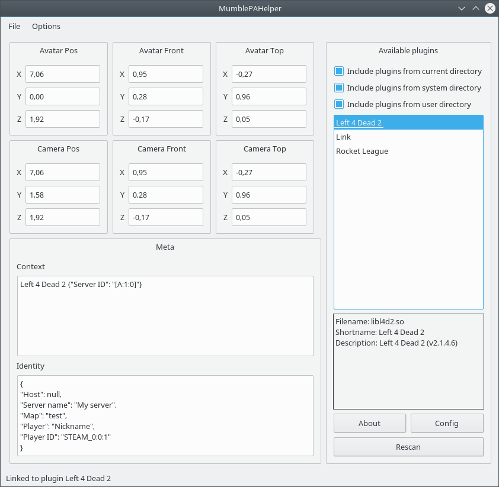

# Mumble Positional Audio Helper

Commit [ba34fec657e1e9f13c7e8f3acabdf7e2301ddee8](https://github.com/mumble-voip/mumble/commit/ba34fec657e1e9f13c7e8f3acabdf7e2301ddee8) in Mumble introduced a built-in replacement for this tool, which can still be used. However, please note that:

1. The project is archived and not officially supported anymore.
2. It only supports the legacy plugins API, which will eventually be deprecated.
3. Both the plugin and the tool should be built with the same compiler, in order to avoid crashes related to ABI incompatibility.

  
Previous content

  

  Mumble Positional Audio Helper is a small tool for testing the functionality
  of positional audio plugins outside of Mumble.

  To test your plugin place it next to MumblePAHelper's executable and launch it.

  ## Default paths

  ### Windows
  System directory: **C:\Program Files\Mumble\Plugins** or **C:\Program Files (x86)\Mumble\Plugins**

  User directory: **%AppData%\Roaming\Mumble\Plugins**

  ### Linux
  System directory: **/usr/lib/mumble**

  User directory: **~/.local/share/Mumble/Mumble/Plugins**
  ___
  Mumble installs the plugins in the system directory and downloads the updated ones in the user
  directory.

  On Windows you need to set the system directory manually if you are using a development snapshot
  or you have installed Mumble in a custom location.

  ## Screenshots
  
  

